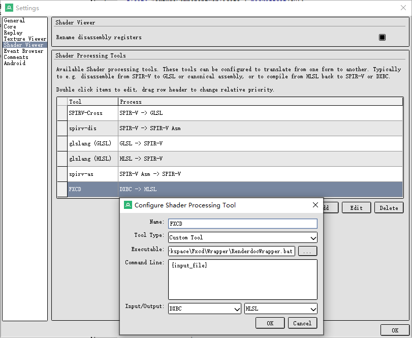
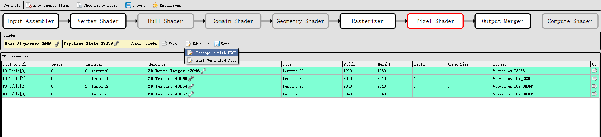
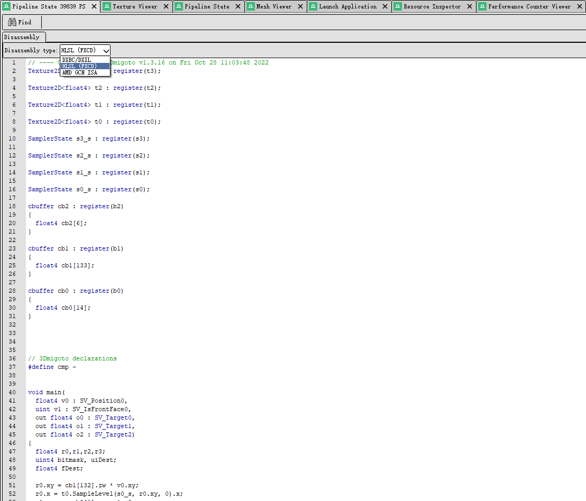

## HLSL Decompiler

Translate dxbc to hlsl source code. You can use it alone, or as a renderdoc shader processing tool to decompile shader. Although the decompiled result looks very like the disassembly, you can edit the decompiled source code and refresh to see the change in Renderdoc. It's very useful while learning and analyzing rendering techniques in games if you don't have source code.

### As Renderdoc Plug-in

1. Download from (release)[https://github.com/hellokenlee/fxcd/releases/tag/v0.2.1]. 

2. Make sure `RenderdocWrapper.bat` and `fxcd.exe` are in the same directory

3. Renderdoc -> Tools -> Settings -> Shader Viewer -> Add
    | Field | Value |
    |------|:--------------:|
    | Name | FXCD |
    | Tool Type | Custom Tool |
    | Executable | Set absolute path of `RenderdocWrapper.bat` |
    | Command Line | {input_file} |
    | Input/Output | DXBC \| HLSL |

    

4.1 Renderdoc -> Pipeline State View -> Choose Any Shader Stage -> Edit -> Decompile with FXCD

4.2 Renderdoc -> Pipeline State View -> Choose Any Shader Stage -> View -> Disassembly type [HLSL (FXCD)]
    
